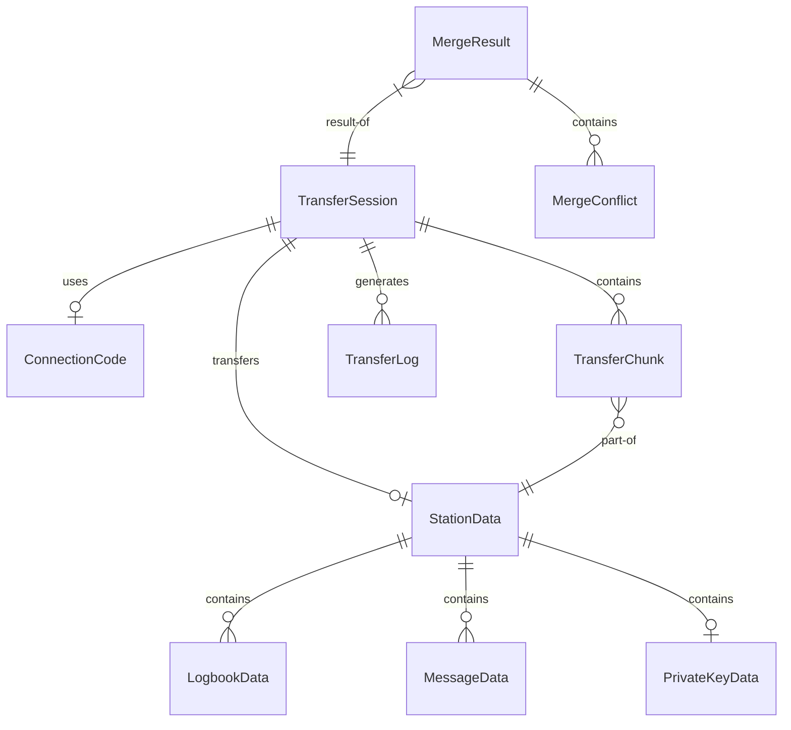

# Data Model: WebRTC Local Data Transfer

**Feature**: WebRTC Local Data Transfer
**Date**: 2025-09-13
**Branch**: `002-a-feature-whereby`

## Entity Definitions

### 1. TransferSession

Represents an active or completed data transfer between two devices.

```typescript
interface TransferSession {
  id: string;                    // UUID for session identification
  status: TransferStatus;         // Current state of transfer
  role: 'sender' | 'receiver';   // This device's role
  peerCallsign?: string;          // Remote station identifier
  connectionCode?: ConnectionCode; // QR/shortcode used
  startTime: string;              // ISO 8601 timestamp
  endTime?: string;               // Completion timestamp
  bytesTransferred: number;       // Progress tracking
  totalBytes: number;             // Total size estimation
  dataTypes: DataType[];         // What's being transferred
  encryptionEnabled: boolean;     // Whether using encryption
  publicKeyFingerprint?: string;  // For verification
  error?: TransferError;          // Error details if failed
}

enum TransferStatus {
  INITIALIZING = 'initializing',
  AWAITING_CONNECTION = 'awaiting_connection',
  CONNECTED = 'connected',
  TRANSFERRING = 'transferring',
  MERGING = 'merging',
  COMPLETED = 'completed',
  FAILED = 'failed',
  CANCELLED = 'cancelled'
}

interface TransferError {
  code: string;
  message: string;
  timestamp: string;
  recoverable: boolean;
}
```

### 2. ConnectionCode

Represents the QR code or shortcode used to establish connection.

```typescript
interface ConnectionCode {
  id: string;                    // Unique identifier
  type: 'qr' | 'shortcode';     // Display format
  value: string;                 // Actual code content
  sdpOffer?: string;             // Compressed SDP data
  publicKey?: string;            // Sender's public key
  createdAt: string;             // Generation timestamp
  expiresAt: string;             // 5 minutes from creation
  dataPreview: DataPreview;      // What will be shared
}

interface DataPreview {
  logbookEntries?: number;       // Count of QSOs
  messages?: number;             // Count of messages
  hasPrivateKeys: boolean;      // Security warning
  hasConfiguration: boolean;     // Settings included
  estimatedSize: number;         // Bytes
}
```

### 3. StationData

Complete set of transferable station data.

```typescript
interface StationData {
  version: string;               // Data format version
  exportedAt: string;           // Export timestamp
  callsign: string;             // Station identifier

  logbook?: LogbookData;        // QSO records
  messages?: MessageData[];      // Ham messages
  contacts?: ContactData[];      // Other operators
  configuration?: ConfigData;    // Radio settings
  privateKeys?: PrivateKeyData; // Identity keys
  customData?: CustomData[];     // User-defined data
}

interface LogbookData {
  entries: QSOEntry[];          // Individual QSOs
  contests?: ContestLog[];      // Contest-specific logs
  awards?: AwardTracking[];     // DXCC, WAS, etc.
  statistics?: LogStatistics;   // Computed stats
}

interface MessageData {
  id: string;
  type: 'sent' | 'received' | 'draft';
  timestamp: string;
  from: string;
  to: string;
  subject?: string;
  body: string;
  attachments?: Attachment[];
}

interface PrivateKeyData {
  encryptionKey?: string;       // Encrypted with password
  signingKey?: string;          // For authentication
  trustedKeys?: TrustedKey[];   // Other stations
}
```

### 4. TransferChunk

Individual data packet sent over WebRTC.

```typescript
interface TransferChunk {
  sequenceNumber: number;        // Order tracking
  totalChunks: number;          // For progress
  dataType: DataType;           // What's in this chunk
  compressed: boolean;          // Whether compressed
  encrypted: boolean;           // Whether encrypted
  checksum: string;             // Integrity check
  data: ArrayBuffer;            // Actual content
}

enum DataType {
  LOGBOOK = 'logbook',
  MESSAGES = 'messages',
  CONTACTS = 'contacts',
  CONFIGURATION = 'configuration',
  PRIVATE_KEYS = 'private_keys',
  CUSTOM = 'custom'
}
```

### 5. TransferLog

Audit record of all transfers for compliance.

```typescript
interface TransferLog {
  id: string;                   // Log entry ID
  sessionId: string;            // Related transfer session
  timestamp: string;            // When logged
  event: TransferEvent;         // What happened
  details: Record<string, any>; // Event-specific data
}

enum TransferEvent {
  SESSION_STARTED = 'session_started',
  CONNECTION_ESTABLISHED = 'connection_established',
  ENCRYPTION_NEGOTIATED = 'encryption_negotiated',
  TRANSFER_STARTED = 'transfer_started',
  CHUNK_SENT = 'chunk_sent',
  CHUNK_RECEIVED = 'chunk_received',
  TRANSFER_COMPLETED = 'transfer_completed',
  TRANSFER_FAILED = 'transfer_failed',
  MERGE_STARTED = 'merge_started',
  MERGE_CONFLICT = 'merge_conflict',
  MERGE_COMPLETED = 'merge_completed'
}
```

### 6. MergeResult

Result of merging imported data with existing data.

```typescript
interface MergeResult {
  dataType: DataType;
  totalRecords: number;
  newRecords: number;
  updatedRecords: number;
  conflicts: MergeConflict[];
  skippedRecords: number;
  mergeStrategy: MergeStrategy;
}

interface MergeConflict {
  recordId: string;
  field: string;
  localValue: any;
  remoteValue: any;
  resolution: ConflictResolution;
  userChoice?: any;
}

enum MergeStrategy {
  ACCEPT_ALL = 'accept_all',
  SKIP_DUPLICATES = 'skip_duplicates',
  MERGE_INTELLIGENT = 'merge_intelligent',
  MANUAL_REVIEW = 'manual_review'
}

enum ConflictResolution {
  USE_LOCAL = 'use_local',
  USE_REMOTE = 'use_remote',
  USE_MERGED = 'use_merged',
  USER_DECIDED = 'user_decided',
  SKIPPED = 'skipped'
}
```

## State Transitions

### TransferSession States

```
INITIALIZING
    ↓ (generate code)
AWAITING_CONNECTION
    ↓ (peer connects)
CONNECTED
    ↓ (start transfer)
TRANSFERRING
    ↓ (all chunks sent)
MERGING
    ↓ (merge complete)
COMPLETED

Any state → FAILED (on error)
Any state → CANCELLED (user action)
```

### ConnectionCode Lifecycle

```
Created (5 min expiry set)
    ↓
Active (can be scanned/entered)
    ↓ (used or expired)
Expired/Used
```

## Validation Rules

### TransferSession
- `id` must be valid UUID v4
- `totalBytes` must be positive if set
- `bytesTransferred` cannot exceed `totalBytes`
- `endTime` must be after `startTime` if set
- `status` transitions must follow state diagram

### ConnectionCode
- `value` must be 6 alphanumeric chars for shortcode
- `value` must be valid QR data for QR type
- `expiresAt` must be exactly 5 minutes after `createdAt`
- `sdpOffer` must be valid SDP format if present

### StationData
- `version` must match current schema version
- `callsign` must be valid amateur radio callsign
- At least one data type must be present
- `privateKeys` requires user confirmation before transfer

### TransferChunk
- `sequenceNumber` must be sequential
- `checksum` must match computed hash of data
- `data` size must not exceed 64KB
- `totalChunks` must match actual chunk count

## Relationships



## IndexedDB Schema

### Object Stores

```typescript
// Transfer sessions
const sessionStore = {
  name: 'transferSessions',
  keyPath: 'id',
  indexes: [
    { name: 'by-status', keyPath: 'status' },
    { name: 'by-time', keyPath: 'startTime' }
  ]
};

// Transfer logs for audit
const logStore = {
  name: 'transferLogs',
  keyPath: 'id',
  indexes: [
    { name: 'by-session', keyPath: 'sessionId' },
    { name: 'by-time', keyPath: 'timestamp' },
    { name: 'by-event', keyPath: 'event' }
  ]
};

// Connection codes
const codeStore = {
  name: 'connectionCodes',
  keyPath: 'id',
  indexes: [
    { name: 'by-expiry', keyPath: 'expiresAt' }
  ]
};

// Merge results
const mergeStore = {
  name: 'mergeResults',
  keyPath: ['sessionId', 'dataType'],
  indexes: [
    { name: 'by-session', keyPath: 'sessionId' }
  ]
};
```

## Security Considerations

### Data Classification
- **Public**: Logbook entries, messages (already transmitted over RF)
- **Sensitive**: Private keys, trusted keys
- **Metadata**: Transfer logs, connection codes

### Encryption Requirements
- Private keys MUST be encrypted during transfer
- Session keys derived per transfer
- Forward secrecy through ephemeral keys

### Access Control
- User must explicitly select data to transfer
- Receiver must accept transfer before data flows
- Private keys require additional confirmation

## Performance Constraints

### Size Limits
- Individual chunk: 64KB maximum
- Total transfer: No hard limit (network constrained)
- QR code: 4KB maximum SDP size
- Shortcode: 6 characters

### Timing Constraints
- Connection timeout: 30 seconds
- Code expiration: 5 minutes
- Session timeout: 30 minutes inactive
- Chunk timeout: 10 seconds

---
*Data model defined. Ready for contract generation.*