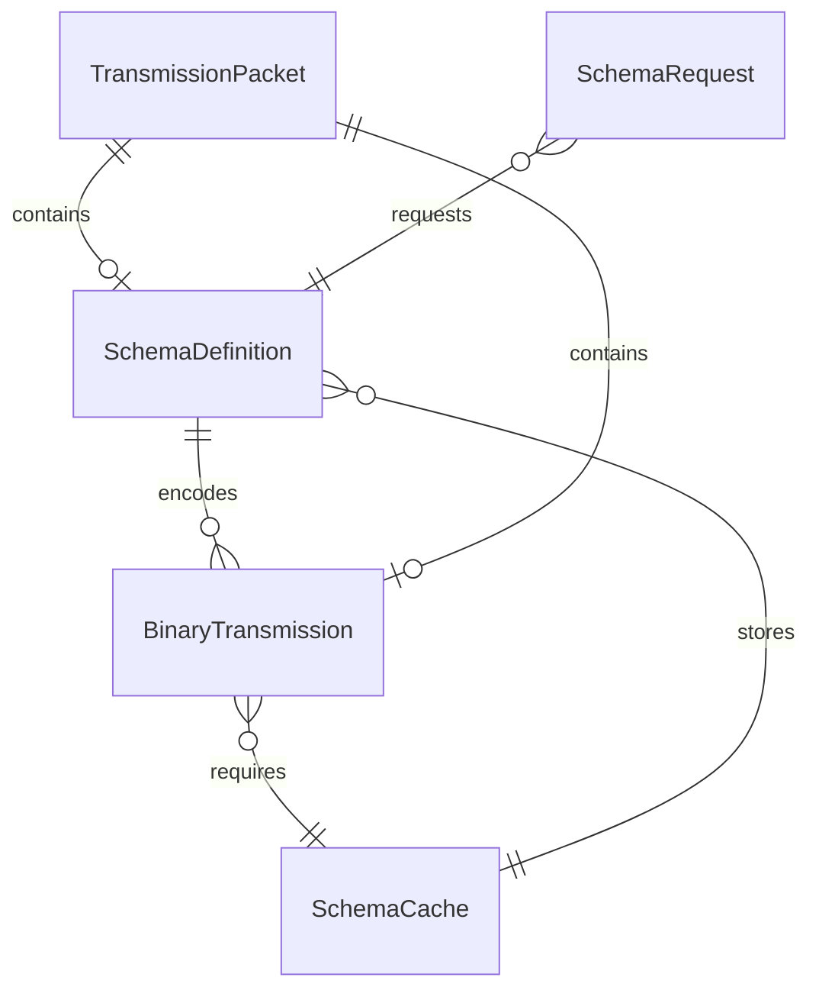

# Data Model: Protocol Buffers for Dynamic Data Transmission

## Core Entities

### 1. SchemaDefinition
Represents a dynamically generated protocol buffer schema.

**Fields:**
- `id: string` - Unique identifier (SHA-256 hash of proto content)
- `version: number` - Schema version number (increments on changes)
- `protoContent: string` - The .proto file content as text
- `compiledSchema: object` - Compiled protobuf.js Root object (runtime only)
- `timestamp: number` - Creation timestamp (milliseconds since epoch)
- `sourceCallsign: string` - Ham radio callsign that generated the schema
- `dataType: string` - Hint about the data type (e.g., "api-response", "mesh-route")

**Validation Rules:**
- `id` must be 64 character hex string
- `version` must be positive integer
- `protoContent` must be valid proto2 syntax
- `sourceCallsign` must match ham radio callsign format
- `timestamp` must be valid Unix timestamp

**State Transitions:**
- Created → Cached → Evicted (session end)
- Created → Transmitted → Received → Cached

### 2. BinaryTransmission
Represents encoded data ready for transmission.

**Fields:**
- `schemaId: string` - Reference to SchemaDefinition.id
- `encodedData: Uint8Array` - Binary protobuf-encoded data
- `compressionType: 'none' | 'brotli' | 'gzip'` - Applied compression
- `originalSize: number` - Size before encoding (bytes)
- `encodedSize: number` - Size after encoding (bytes)
- `requiresSchema: boolean` - Whether schema should be sent first

**Validation Rules:**
- `schemaId` must reference existing or pending schema
- `encodedData` must be valid binary data
- `encodedSize` must be less than `originalSize` (efficiency check)
- `compressionType` must be supported algorithm

**State Transitions:**
- Pending → Encoded → Compressed → Transmitted
- Received → Decompressed → Decoded → Processed

### 3. SchemaCache
Manages session-based schema storage.

**Fields:**
- `schemas: Map<string, SchemaDefinition>` - In-memory cache
- `sessionId: string` - Current session identifier
- `maxSize: number` - Maximum cache size in bytes
- `currentSize: number` - Current cache usage in bytes
- `hitCount: Map<string, number>` - Access frequency tracking
- `evictionPolicy: 'LRU' | 'LFU' | 'FIFO'` - Cache eviction strategy

**Validation Rules:**
- `currentSize` must not exceed `maxSize`
- `sessionId` must be valid UUID
- `schemas` size must match `currentSize` calculation

**Operations:**
- `get(id)` - Retrieve schema, update hit count
- `set(id, schema)` - Store schema, evict if needed
- `has(id)` - Check existence
- `clear()` - Session end cleanup
- `evict()` - Remove least recently used

### 4. TransmissionPacket
Combined unit for over-the-air transmission.

**Fields:**
- `packetType: 'schema' | 'data' | 'schema+data'` - Packet contents
- `sequence: number` - Packet sequence number
- `totalPackets: number` - Total in this transmission
- `schemaPayload?: SchemaDefinition` - Optional schema
- `dataPayload?: BinaryTransmission` - Optional data
- `checksum: string` - CRC32 checksum for validation
- `timestamp: number` - Transmission time

**Validation Rules:**
- `sequence` must be between 1 and `totalPackets`
- At least one payload must be present
- `checksum` must match calculated value
- `packetType` must match payload presence

**State Transitions:**
- Created → Queued → Transmitting → Acknowledged
- Transmitting → Failed → Retrying → Acknowledged

### 5. SchemaRequest
Request for missing schema from originating station.

**Fields:**
- `requestId: string` - Unique request identifier
- `schemaId: string` - Requested schema ID
- `requestingCallsign: string` - Station making request
- `targetCallsign: string` - Station that has the schema
- `priority: 'low' | 'normal' | 'high'` - Request urgency
- `retryCount: number` - Number of attempts
- `maxRetries: number` - Maximum retry limit

**Validation Rules:**
- `requestId` must be valid UUID
- `retryCount` must not exceed `maxRetries`
- Callsigns must be valid ham radio format
- `schemaId` must be 64 character hex string

**State Transitions:**
- Pending → Sent → Waiting → Received → Completed
- Waiting → Timeout → Retrying → Sent
- Retrying → MaxRetries → Failed

## Relationships

## Constraints

### Performance Constraints
- Schema generation: <50ms for objects up to 100 fields
- Cache lookup: O(1) average case
- Encoding: <10ms for 10KB payload
- Decoding: <10ms for 10KB payload

### Storage Constraints
- Maximum schema size: 10KB
- Maximum cache size: 5MB (configurable)
- Maximum encoded data size: 64KB per transmission
- Session storage limit: 10MB total

### Bandwidth Constraints
- Schema transmission: Once per session per unique schema
- Packet overhead: <100 bytes per transmission
- Compression ratio target: >60% reduction

## Indexes

For IndexedDB persistence:
- Primary: `schemaId` (unique)
- Secondary: `sourceCallsign` (for schema discovery)
- Secondary: `timestamp` (for cleanup)
- Secondary: `dataType` (for categorization)

## Migration Strategy

Since this is a new feature, no migration needed. Future versions must:
1. Maintain backward compatibility with proto2 syntax
2. Support schema version negotiation
3. Gracefully handle unknown field types
4. Preserve session-based eviction model