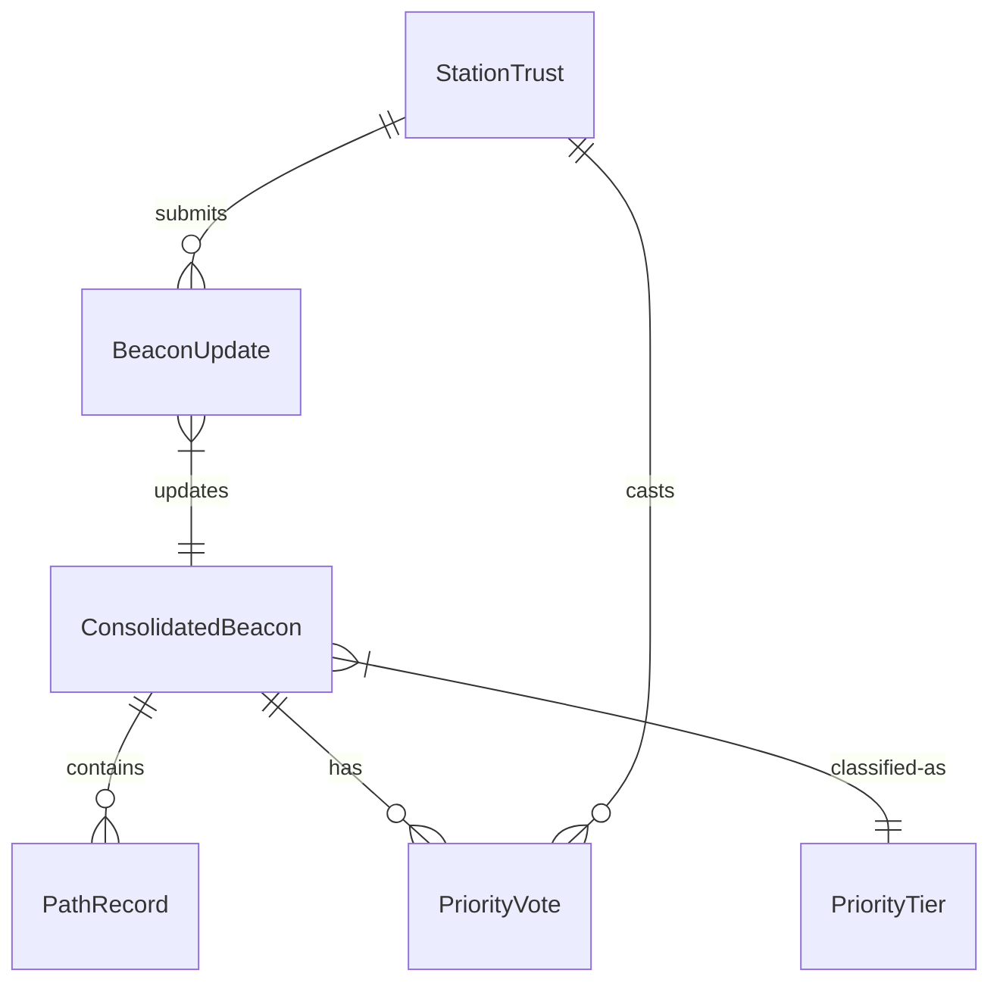

# Data Model: Server CQ Storage

**Feature**: Server CQ Storage | **Date**: 2025-09-18

## Core Entities

### ConsolidatedBeacon
Represents a content item with multiple access paths, stored both server-side and client-side.

```typescript
interface ConsolidatedBeacon {
  // Primary key
  contentHash: string;          // SHA-256 hash of content

  // Content metadata
  callsign: string;             // Original content creator
  url?: string;                 // Optional URL path
  size: number;                 // Total content size in bytes
  mimeType: string;             // Content MIME type
  chunks?: number[];            // Available chunk indices for RF

  // Priority and retention
  priorityTier: PriorityTier;   // P0-P5 classification
  createdAt: Date;              // First seen timestamp
  expiresAt: Date;              // TTL expiration
  lastHeard: Date;              // Most recent update

  // Access paths (ordered by quality)
  paths: PathRecord[];          // Multiple routes to content

  // Availability modes
  hasWebRTC: boolean;           // Full file via WebRTC
  hasRFChunks: boolean;         // Chunks via RF

  // Metadata
  metadata: {
    keywords?: string[];        // Detected priority keywords
    votes?: PriorityVote[];     // Network consensus votes
    conflictFlags?: string[];   // Size/type conflicts
  };
}
```

### PathRecord
Individual route to content through the mesh network.

```typescript
interface PathRecord {
  // Route information
  path: string[];               // Ordered callsigns (e.g., ["KB2DEF", "KC3GHI"])

  // Quality metrics
  lastHeard: Date;              // When path was last confirmed
  hopCount: number;             // Number of hops (path.length)
  signalQuality: number;        // 0.0-1.0 signal strength

  // Calculated score
  qualityScore?: number;        // Computed from metrics
}
```

### PriorityTier
Enumeration of content priority levels.

```typescript
enum PriorityTier {
  P0_Emergency = 0,       // Life safety (30d server / 24h client)
  P1_Infrastructure = 1,  // Essential services (14d / 12h)
  P2_Logistics = 2,       // Resources (7d / 6h)
  P3_Community = 3,       // Reunification (14d / 12h)
  P4_Operational = 4,     // Situational (3d / 3h)
  P5_Routine = 5          // General (6h / 1h)
}
```

### StationTrust
Reputation tracking for content-announcing stations.

```typescript
interface StationTrust {
  // Identity
  callsign: string;             // Station identifier

  // Reputation metrics
  trustScore: number;           // 0-100 reputation score
  beaconCount: number;          // Total beacons submitted
  verifiedCount: number;        // Beacons verified by others
  conflictCount: number;        // Conflicting metadata incidents

  // Privileges
  maxEntries: number;           // Current entry limit (10-50)
  isVerified: boolean;          // Verified by 2+ stations
  canSetEmergency: boolean;     // Can declare P0 priority

  // Activity
  firstSeen: Date;              // Registration date
  lastActive: Date;             // Most recent submission
}
```

### PriorityVote
Network consensus vote for content priority.

```typescript
interface PriorityVote {
  callsign: string;             // Voting station
  priorityTier: PriorityTier;   // Voted priority
  timestamp: Date;              // Vote time
  weight: number;               // Vote weight (reputation-based)
}
```

### BeaconUpdate
Incoming beacon data from hybrid stations.

```typescript
interface BeaconUpdate {
  // Authentication
  callsign: string;             // Submitting station
  signature: string;            // ECDSA signature

  // Content identification
  contentHash: string;          // Content being announced

  // New information
  path: string[];               // Path heard via
  metadata?: {
    url?: string;
    size?: number;
    mimeType?: string;
    chunks?: number[];
    priority?: PriorityTier;
  };

  // Quality indicators
  signalQuality?: number;       // Reception quality
  timestamp: Date;              // When heard
}
```

## State Transitions

### Beacon Lifecycle
```
NEW → ACTIVE → STALE → EXPIRED → DELETED

NEW: First announcement received
ACTIVE: Regular updates, paths fresh (<1hr)
STALE: No updates for 1+ hours, paths pruning
EXPIRED: Past TTL, awaiting deletion
DELETED: Removed from storage
```

### Priority Transitions
```
Initial Assignment → Consensus Adjustment → Age Demotion → Demand Elevation

Initial: Creator declaration or keyword detection
Consensus: 3+ stations vote, majority wins
Age Demotion: After 48 hours, drop one tier
Demand Elevation: >10 requests/hour, raise one tier
```

### Path Quality States
```
FRESH → AGING → DEAD → PRUNED

FRESH: Heard <15 minutes ago (score 1.0)
AGING: Heard 15-60 minutes ago (score 0.3-0.9)
DEAD: Not heard >1 hour (score 0.0)
PRUNED: Removed from path list
```

## Validation Rules

### Content Hash
- Must be valid SHA-256 (64 hex characters)
- Must be unique per beacon entry
- Case-insensitive storage and comparison

### Callsign
- Must match amateur radio format: /^[A-Z]{1,2}[0-9]{1}[A-Z]{1,4}$/
- Examples: KA1ABC, W5XYZ, VE3DEF
- Must be uppercase for consistency

### Priority Assignment
- P0 requires verified station OR emergency keyword
- Test messages with "TEST" or "DRILL" → always P5
- ARES/RACES callsigns → minimum P1
- Expired content → immediate demotion to P5

### Path Validation
- Maximum 10 paths per content
- Maximum 7 hops per path
- No circular paths (station appears twice)
- Ordered by quality score

### Storage Limits
- Server: 1GB total (≈500,000 entries)
- Client: 50MB total (≈25,000 entries)
- Per-station: 50 entries maximum
- Rate limit: 10 beacons/minute/station

## Relationships



## Indexing Strategy

### Server (SQLite)
1. Primary: content_hash
2. Compound: (priority_tier, expires_at) - for eviction
3. Single: callsign - for station queries
4. Single: last_heard - for freshness checks

### Client (IndexedDB)
1. Primary: contentHash
2. Compound: ['priorityTier', 'expiresAt'] - for pruning
3. Single: 'callsign' - for station filtering
4. Single: 'lastHeard' - for recency sorting

## Migration Considerations

### Schema Version 1.0.0
- Initial release with all entities
- No migration needed

### Future Migrations
- Add version field to ConsolidatedBeacon
- Migration script to run on server startup
- Client migration in IndexedDB upgrade handler
- Backward compatibility for 1 major version

---
*Data model defined: 2025-09-18*