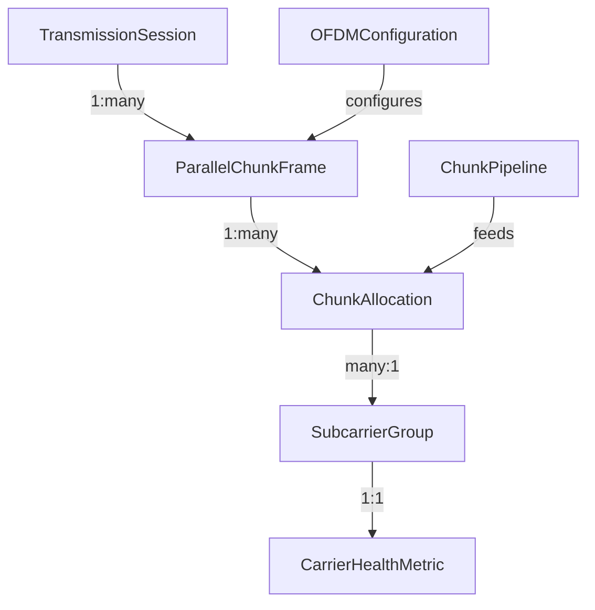

# Data Model: OFDM Parallel Chunk Transmission

## Entity Definitions

### 1. ParallelChunkFrame
Represents a complete OFDM symbol containing multiple BitTorrent chunks transmitted in parallel.

**Fields**:
- `frameId`: number - Unique frame sequence number
- `timestamp`: number - Transmission time (ms since epoch)
- `symbolDuration`: number - Duration of OFDM symbol in ms (23.2ms default)
- `chunkAllocations`: ChunkAllocation[] - Array of chunk-to-subcarrier mappings
- `pilotTones`: PilotTone[] - Pilot tone positions and values
- `cyclicPrefix`: number - Guard interval duration in samples

**Validation**:
- frameId must increment sequentially
- timestamp must be monotonic
- chunkAllocations.length <= 48 (max subcarriers)
- pilotTones.length = 5 (fixed pilot positions)

**State Transitions**:
- PENDING → TRANSMITTING → TRANSMITTED
- PENDING → TRANSMITTING → FAILED (on carrier failure)

### 2. ChunkAllocation
Maps a BitTorrent chunk to specific OFDM subcarriers for parallel transmission.

**Fields**:
- `chunkId`: string - BitTorrent chunk hash
- `chunkIndex`: number - Position in torrent (0-based)
- `subcarriers`: number[] - Assigned subcarrier indices (1-4 carriers)
- `modulation`: 'BPSK' | 'QPSK' | '16QAM' - Modulation per carrier group
- `priority`: number - Transmission priority (0-10, higher = more important)
- `retryCount`: number - Number of transmission attempts

**Validation**:
- subcarriers.length between 1 and 4
- subcarrier indices between 0 and 47
- priority 0-10 (10 = emergency content)
- No subcarrier assigned to multiple chunks in same frame

**State Transitions**:
- QUEUED → ALLOCATED → TRANSMITTING → COMPLETE
- TRANSMITTING → REALLOCATING (on carrier failure)

### 3. SubcarrierGroup
Represents a group of 1-4 OFDM subcarriers working together to transmit a single chunk.

**Fields**:
- `groupId`: number - Group identifier (0-11 for 48 carriers/4)
- `carrierIndices`: number[] - Actual subcarrier frequencies
- `centerFrequency`: number - Center frequency in Hz
- `bandwidth`: number - Group bandwidth in Hz
- `currentChunk`: string | null - Currently assigned chunk ID
- `modulation`: 'BPSK' | 'QPSK' | '16QAM' - Current modulation

**Validation**:
- carrierIndices.length <= 4
- All carriers must be contiguous
- bandwidth = carrierIndices.length * 43 Hz

### 4. CarrierHealthMetric
Tracks real-time quality metrics for each OFDM subcarrier.

**Fields**:
- `carrierId`: number - Subcarrier index (0-47)
- `frequency`: number - Carrier frequency in Hz
- `snr`: number - Signal-to-noise ratio in dB
- `ber`: number - Bit error rate (0-1)
- `enabled`: boolean - Whether carrier is active
- `lastUpdate`: number - Timestamp of last measurement
- `history`: SNRReading[] - Recent SNR measurements (last 10)

**Validation**:
- snr range: -10 to 40 dB
- ber range: 0 to 1
- Disable carrier if snr < 5 dB
- history.length <= 10 (sliding window)

**State Transitions**:
- HEALTHY (SNR > 15) → DEGRADED (SNR 5-15) → FAILED (SNR < 5)
- FAILED → RECOVERING → HEALTHY (after 10 good symbols)

### 5. ChunkPipeline
Queue of chunks waiting for transmission with priority ordering.

**Fields**:
- `queue`: QueuedChunk[] - Prioritized chunk queue
- `maxLength`: number - Maximum queue size (default 500)
- `rarityMap`: Map<string, number> - Chunk rarity scores
- `swarmSize`: number - Number of peers in swarm
- `completionTarget`: number - Target completion percentage

**Validation**:
- queue.length <= maxLength
- Rarity scores between 0 and 1
- Higher rarity = higher priority

### 6. OFDMConfiguration
System-wide OFDM transmission parameters.

**Fields**:
- `sampleRate`: number - Audio sample rate (11025 Hz)
- `fftSize`: number - FFT points (256)
- `numSubcarriers`: number - Active subcarriers (48)
- `subcarrierSpacing`: number - Frequency spacing (43 Hz)
- `symbolDuration`: number - Time per symbol (23.2 ms)
- `cyclicPrefixRatio`: number - Guard interval (0.25)
- `bandwidth`: number - Total bandwidth (2800 Hz)

**Validation**:
- fftSize must be power of 2
- numSubcarriers <= fftSize/2
- bandwidth <= 2800 Hz (FCC limit)

### 7. TransmissionSession
Tracks a complete parallel chunk transfer session.

**Fields**:
- `sessionId`: string - Unique session identifier
- `startTime`: number - Session start timestamp
- `chunksTransmitted`: number - Successfully sent chunks
- `totalChunks`: number - Total chunks to transmit
- `throughput`: number - Current throughput in bps
- `parallelStreams`: number - Active parallel transmissions
- `failedCarriers`: number[] - List of failed carrier IDs

**Validation**:
- parallelStreams <= 48
- throughput calculated from chunksTransmitted/duration

## Relationships

## Indexed Fields
For efficient querying in IndexedDB:

1. **ParallelChunkFrame**:
   - Primary: frameId
   - Index: timestamp

2. **ChunkAllocation**:
   - Primary: chunkId
   - Index: priority, chunkIndex

3. **CarrierHealthMetric**:
   - Primary: carrierId
   - Index: snr, enabled

4. **ChunkPipeline**:
   - Primary: queue[0].chunkId (head of queue)
   - Index: rarity score

## Storage Estimates
- ParallelChunkFrame: ~2 KB per frame
- ChunkAllocation: ~200 bytes per allocation
- CarrierHealthMetric: ~500 bytes per carrier
- At 50 frames/second: ~6 MB/minute of metrics
- IndexedDB quota: Request 50 MB for OFDM data

## Data Retention
- CarrierHealthMetric: Keep last 1000 readings (sliding window)
- ParallelChunkFrame: Keep last 100 frames for debugging
- TransmissionSession: Persist until completion + 24 hours
- ChunkPipeline: Clear completed chunks immediately