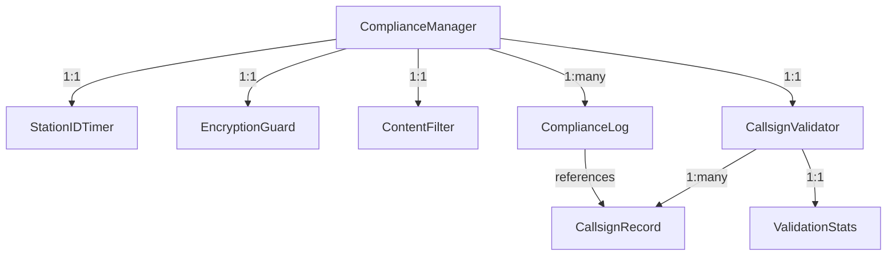

# Data Model: FCC Compliance Implementation

## Entity Definitions

### 1. ComplianceManager
Central coordinator for all FCC Part 97 compliance checking and enforcement.

**Fields**:
- `isEnabled`: boolean - Whether compliance checking is active
- `operatorCallsign`: string - Current operator's callsign
- `licenseClass`: 'NOVICE' | 'TECHNICIAN' | 'GENERAL' | 'ADVANCED' | 'EXTRA' - Operator license class
- `emergencyMode`: boolean - Emergency communications override active
- `currentMode`: 'RF' | 'WEBRTC' | 'HYBRID' - Current transmission mode
- `lastComplianceCheck`: number - Timestamp of last compliance validation
- `violationCount`: number - Count of violations this session

**Validation**:
- operatorCallsign must match valid amateur radio format
- licenseClass determines frequency/power privileges
- emergencyMode overrides some content restrictions
- currentMode determines encryption blocking

**State Transitions**:
- INACTIVE → ACTIVE (when transmission starts)
- NORMAL → EMERGENCY (when emergency declared)
- COMPLIANT → WARNING → VIOLATION (compliance status progression)

### 2. StationIDTimer
Tracks transmission time and manages FCC-required 10-minute station identification.

**Fields**:
- `timerId`: string - Unique timer instance identifier
- `transmissionStartTime`: number - When current transmission session began
- `lastIDTime`: number - Timestamp of last station identification
- `nextIDDue`: number - When next ID is required (start + 10 minutes)
- `isTransmitting`: boolean - Whether currently transmitting
- `autoIDEnabled`: boolean - Whether automatic ID is enabled
- `pendingID`: boolean - ID transmission queued but not sent

**Validation**:
- nextIDDue must be ≤ 10 minutes from transmissionStartTime
- lastIDTime must be ≤ nextIDDue for compliance
- autoIDEnabled should default to true

**State Transitions**:
- IDLE → TRANSMITTING → ID_DUE → ID_SENT → TRANSMITTING (cycle)
- TRANSMITTING → END_OF_TRANSMISSION → ID_SENT → IDLE

### 3. EncryptionGuard
Monitors and blocks content encryption based on transmission mode to ensure FCC compliance.

**Fields**:
- `guardId`: string - Unique guard instance identifier
- `transmissionMode`: 'RF' | 'WEBRTC' | 'HYBRID' - Current mode being monitored
- `encryptionBlocked`: boolean - Whether encryption is currently blocked
- `violationAttempts`: number - Count of blocked encryption attempts
- `lastViolationTime`: number - Timestamp of last violation attempt
- `allowedOperations`: string[] - List of permitted crypto operations (signatures only)
- `blockedOperations`: string[] - List of blocked crypto operations

**Validation**:
- encryptionBlocked = true when transmissionMode === 'RF'
- allowedOperations may include: 'sign', 'verify', 'hash'
- blockedOperations includes: 'encrypt', 'decrypt', 'ecdh'

**State Transitions**:
- PERMISSIVE (WebRTC) → BLOCKING (RF) → PERMISSIVE (WebRTC)
- NORMAL → VIOLATION_DETECTED → WARNING_DISPLAYED → NORMAL

### 4. ContentFilter
Scans and filters content to prevent transmission of prohibited material per FCC regulations.

**Fields**:
- `filterId`: string - Unique filter instance identifier
- `filterLevel`: 'STRICT' | 'MODERATE' | 'PERMISSIVE' - Filtering sensitivity
- `blockedMimeTypes`: string[] - MIME types prohibited on RF (audio/*, video/*)
- `profanityList`: string[] - Words that trigger warnings
- `businessKeywords`: string[] - Commercial content indicators
- `emergencyBypass`: boolean - Whether emergency mode overrides filters
- `lastScanTime`: number - Timestamp of last content scan

**Validation**:
- blockedMimeTypes must include 'audio/*' for music restriction
- businessKeywords include: 'sale', 'profit', 'business', 'commercial'
- emergencyBypass allows override only during declared emergency

**State Transitions**:
- SCANNING → CLEAN | FLAGGED | BLOCKED
- FLAGGED → USER_CONFIRMED | USER_REJECTED
- BLOCKED → OVERRIDE_REQUESTED | TRANSMISSION_ABORTED

### 5. CallsignValidator
Validates amateur radio callsigns and manages license verification.

**Fields**:
- `validatorId`: string - Unique validator instance identifier
- `localDatabase`: Map<string, CallsignRecord> - Cached callsign database
- `lastDatabaseUpdate`: number - When database was last refreshed
- `onlineValidationEnabled`: boolean - Whether to use online APIs
- `validationCacheTimeout`: number - How long to cache validation results (ms)
- `internationalEnabled`: boolean - Whether to validate non-US callsigns
- `validationStats`: ValidationStats - Performance metrics

**Validation**:
- localDatabase should be updated weekly minimum
- validationCacheTimeout default: 24 hours
- International validation requires QRZ.com or similar API

**State Transitions**:
- VALIDATING → VALID | INVALID | UNKNOWN
- CACHE_HIT → RETURN_RESULT
- CACHE_MISS → QUERY_DATABASE → CACHE_RESULT

### 6. CallsignRecord
Individual amateur radio license record for validation.

**Fields**:
- `callsign`: string - Amateur radio callsign (e.g., 'KA1ABC')
- `licenseClass`: 'NOVICE' | 'TECHNICIAN' | 'GENERAL' | 'ADVANCED' | 'EXTRA'
- `firstName`: string - License holder first name
- `lastName`: string - License holder last name
- `country`: string - License issuing country (ISO 3166-1)
- `isValid`: boolean - Whether license is currently valid
- `expirationDate`: number - License expiration timestamp
- `grantDate`: number - When license was granted
- `source`: 'FCC' | 'QRZ' | 'LOCAL' - Data source

**Validation**:
- callsign must match amateur radio format (country-specific)
- expirationDate must be future for isValid = true
- US callsigns: format validation against FCC patterns

### 7. ComplianceLog
Audit trail of all compliance-related events for FCC inspection capability.

**Fields**:
- `logId`: string - Unique log entry identifier
- `timestamp`: number - When event occurred
- `eventType`: 'STATION_ID' | 'ENCRYPTION_BLOCK' | 'CONTENT_FILTER' | 'CALLSIGN_VALIDATION' | 'VIOLATION'
- `description`: string - Human-readable event description
- `operatorCallsign`: string - Callsign of responsible operator
- `transmissionMode`: 'RF' | 'WEBRTC' | 'HYBRID' - Mode when event occurred
- `severity`: 'INFO' | 'WARNING' | 'VIOLATION' - Event severity level
- `details`: Object - Additional structured data about event
- `resolved`: boolean - Whether issue was resolved

**Validation**:
- timestamp must be accurate and monotonic
- operatorCallsign must be valid when event occurred
- VIOLATION severity requires operator acknowledgment

**State Transitions**:
- LOGGED → INDEXED → SEARCHABLE
- VIOLATION → ACKNOWLEDGED | UNRESOLVED

### 8. ValidationStats
Performance and accuracy metrics for compliance system monitoring.

**Fields**:
- `statsId`: string - Unique stats collection identifier
- `totalValidations`: number - Total callsign validations performed
- `cacheHitRate`: number - Percentage of validations served from cache
- `averageValidationTime`: number - Mean validation time in milliseconds
- `falsePositiveRate`: number - Rate of incorrect blocking (operator reports)
- `falseNegativeRate`: number - Rate of missed violations (estimated)
- `complianceUptime`: number - Percentage of time compliance system active
- `lastResetTime`: number - When statistics were last reset

**Validation**:
- Rates must be between 0 and 1 (percentages as decimals)
- averageValidationTime should be <100ms for good performance
- complianceUptime should be >99% for critical systems

## Relationships

## Indexed Fields
For efficient querying in IndexedDB:

1. **ComplianceLog**:
   - Primary: logId
   - Index: timestamp, eventType, operatorCallsign, severity

2. **CallsignRecord**:
   - Primary: callsign
   - Index: country, licenseClass, expirationDate

3. **StationIDTimer**:
   - Primary: timerId
   - Index: nextIDDue, isTransmitting

## Storage Estimates
- ComplianceLog: ~1 KB per entry, ~1000 entries/day = ~1 MB daily
- CallsignRecord: ~500 bytes per record, ~1M US records = ~500 MB
- ValidationStats: ~2 KB total
- Other entities: ~10 KB total
- Total storage: ~500 MB (mostly callsign database)

## Data Retention
- ComplianceLog: Keep 2 years for FCC audit requirements
- CallsignRecord: Update weekly, keep expired licenses 1 year
- ValidationStats: Reset monthly, keep historical summaries
- StationIDTimer: Clear when transmission ends
- ContentFilter: Clear scan results after transmission

## Compliance Integration Points
- **Transmission Mode**: Hook into existing transmission-mode library
- **Crypto Operations**: Intercept all crypto/* function calls
- **Mesh Networking**: Validate callsigns before relay
- **Content Upload**: Filter before adding to mesh-dl-protocol
- **Station Data**: Block export in RF mode via transfer-crypto guard

## Emergency Mode Behavior
When `emergencyMode = true`:
- ContentFilter: Allow most content types (except encrypted)
- StationID: Continue required identification
- CallsignValidator: Allow emergency callsigns (EM*, etc.)
- EncryptionGuard: Still block encryption (FCC requirement)
- ComplianceLog: Mark all events with emergency context