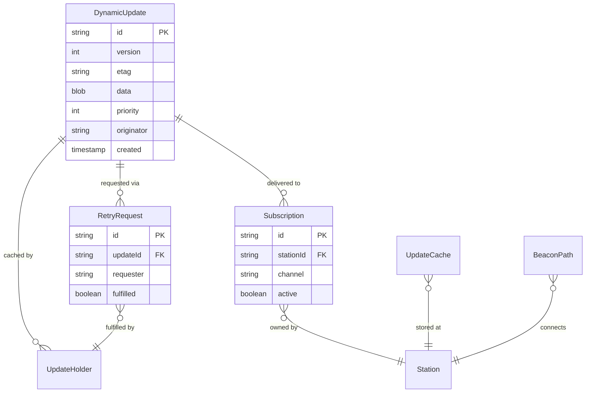

# Data Model: Dynamic Data

## Core Entities

### DynamicUpdate
Primary entity representing time-sensitive data distributed across the network.

```typescript
interface DynamicUpdate {
  // Identification
  id: string;                 // Unique identifier (e.g., "EMRG-2024-001")
  version: number;            // Sequential version number
  etag: string;              // Entity tag for caching

  // Content
  data: Uint8Array;          // Actual update content (max 50KB)
  contentType: string;       // MIME type of content
  compression: 'none' | 'lz77' | 'gzip';

  // Metadata
  priority: 0 | 1 | 2 | 3 | 4 | 5;  // P0=Emergency to P5=Routine
  category: UpdateCategory;   // Type of update
  created: Date;             // Creation timestamp
  expires: Date;             // Expiration based on priority

  // Distribution
  originator: string;        // Callsign of creating station
  subscribers: string[];     // Target stations
  signature: string;         // ECDSA signature for authenticity
}

enum UpdateCategory {
  EMERGENCY = 'emergency',
  SAFETY = 'safety',
  WEATHER = 'weather',
  TRAFFIC = 'traffic',
  STATUS = 'status',
  ROUTINE = 'routine'
}
```

### Subscription
Represents a station's interest in specific update categories.

```typescript
interface Subscription {
  id: string;                // UUID
  stationId: string;        // Callsign or identifier
  channel: string;          // Update category/channel
  created: Date;            // Subscription timestamp
  active: boolean;          // Current status
  licensed: boolean;        // Whether station is licensed
}
```

### RetryRequest
Licensed station request for missed update retransmission.

```typescript
interface RetryRequest {
  id: string;               // UUID
  updateId: string;        // Update being requested
  version: number;         // Specific version needed
  requester: string;       // Licensed station callsign
  signature: string;       // ECDSA authentication
  timestamp: Date;         // Request time
  fulfilled: boolean;      // Whether retry was completed
  fulfiller?: string;      // Station that provided retry
}
```

### UpdateCache
Local storage of updates at relay stations.

```typescript
interface UpdateCache {
  updateId: string;        // Reference to update
  stationId: string;       // Caching station
  received: Date;          // When cached
  lastAccessed: Date;      // For LRU eviction
  size: number;            // Bytes consumed
  priority: number;        // For eviction decisions
}
```

### BeaconPath
Tracks RF beacon paths for routing decisions.

```typescript
interface BeaconPath {
  originStation: string;   // Source station
  targetStation: string;   // Destination
  lastHeard: Date;        // Most recent beacon
  hopCount: number;       // Number of relay hops
  signalStrength: number; // SNR in dB
  mode: 'RF' | 'WebRTC'; // Communication mode
}
```

### UpdateHolder
Registry of stations that have specific updates.

```typescript
interface UpdateHolder {
  updateId: string;       // Update reference
  stationId: string;      // Station with the data
  receivedAt: Date;       // When they got it
  available: boolean;     // Currently online/available
  licensed: boolean;      // Can transmit
}
```

## Relationships



## State Transitions

### Update Lifecycle
```
Created -> Broadcast -> Cached -> [Delivered | Expired | Evicted]
```

### Retry Flow
```
Requested -> Coordinating -> Transmitting -> Fulfilled
```

### Subscription States
```
Active -> [Cancelled | Expired]
```

## Storage Schemas

### IndexedDB (Client-side)
```javascript
// Updates store
{
  keyPath: 'id',
  indexes: [
    { name: 'priority', keyPath: 'priority' },
    { name: 'expires', keyPath: 'expires' },
    { name: 'category', keyPath: 'category' }
  ]
}

// Subscriptions store
{
  keyPath: 'id',
  indexes: [
    { name: 'channel', keyPath: 'channel' },
    { name: 'active', keyPath: 'active' }
  ]
}

// Cache metadata store
{
  keyPath: 'updateId',
  indexes: [
    { name: 'lastAccessed', keyPath: 'lastAccessed' },
    { name: 'size', keyPath: 'size' }
  ]
}
```

### SQLite (Signaling Server)
```sql
-- Updates metadata (not content)
CREATE TABLE updates (
  id TEXT PRIMARY KEY,
  version INTEGER NOT NULL,
  priority INTEGER NOT NULL,
  etag TEXT NOT NULL,
  size INTEGER NOT NULL,
  created_at INTEGER NOT NULL,
  expires_at INTEGER NOT NULL
);

-- Track who has what
CREATE TABLE update_holders (
  update_id TEXT,
  station_id TEXT,
  received_at INTEGER,
  licensed BOOLEAN,
  PRIMARY KEY (update_id, station_id),
  FOREIGN KEY (update_id) REFERENCES updates(id)
);

-- Subscription registry
CREATE TABLE subscriptions (
  id TEXT PRIMARY KEY,
  station_id TEXT NOT NULL,
  channel TEXT NOT NULL,
  created_at INTEGER NOT NULL,
  active BOOLEAN DEFAULT 1,
  UNIQUE(station_id, channel)
);

-- Retry tracking
CREATE TABLE retry_requests (
  id TEXT PRIMARY KEY,
  update_id TEXT NOT NULL,
  requester TEXT NOT NULL,
  signature TEXT NOT NULL,
  requested_at INTEGER NOT NULL,
  fulfilled BOOLEAN DEFAULT 0,
  fulfiller TEXT,
  FOREIGN KEY (update_id) REFERENCES updates(id)
);

-- Beacon paths for routing
CREATE TABLE beacon_paths (
  origin TEXT NOT NULL,
  target TEXT NOT NULL,
  last_heard INTEGER NOT NULL,
  hop_count INTEGER,
  signal_strength REAL,
  PRIMARY KEY (origin, target)
);
```

## Data Constraints

### Size Limits
- Maximum update size: 50KB (configurable)
- Maximum subscribers per update: 1000
- Maximum concurrent updates: 100
- Maximum cache size per station: 100MB

### Retention Policies
- P0 (Emergency): 30 days
- P1 (Safety): 7 days
- P2 (Operational): 24 hours
- P3-P5 (Routine): 1 hour

### Validation Rules
- Update ID must be unique
- Version numbers must increment
- Signatures must be valid ECDSA
- Priority must be 0-5
- Expiration must be future timestamp
- Only licensed stations in update_holders.licensed

## Performance Considerations

### Indexing Strategy
- Primary indexes on IDs for fast lookup
- Secondary indexes on priority for eviction
- Composite index on (station_id, channel) for subscriptions
- Time-based indexes for expiration cleanup

### Cache Eviction Algorithm
```
1. Remove expired updates (by expires_at)
2. If still over capacity:
   - Remove lowest priority first
   - Within same priority, remove oldest (by lastAccessed)
3. Never evict P0/P1 unless expired
```

### Query Patterns
- Find updates by priority: O(log n)
- Check subscription: O(1) with hash
- Find retry requests: O(log n) by update_id
- Get beacon path: O(1) with composite key

## Security Model

### Authentication
- All updates signed with originator's ECDSA key
- Retry requests authenticated with requester's signature
- Subscriptions validated against station registry

### Authorization
- Only licensed stations can:
  - Create updates
  - Request retries
  - Transmit data
- Unlicensed stations can:
  - Subscribe to channels
  - Receive via WebRTC
  - Cache locally (not redistribute)

### Data Integrity
- ETags prevent version conflicts
- Checksums detect corruption
- Timestamps prevent replay attacks
- Signatures ensure authenticity